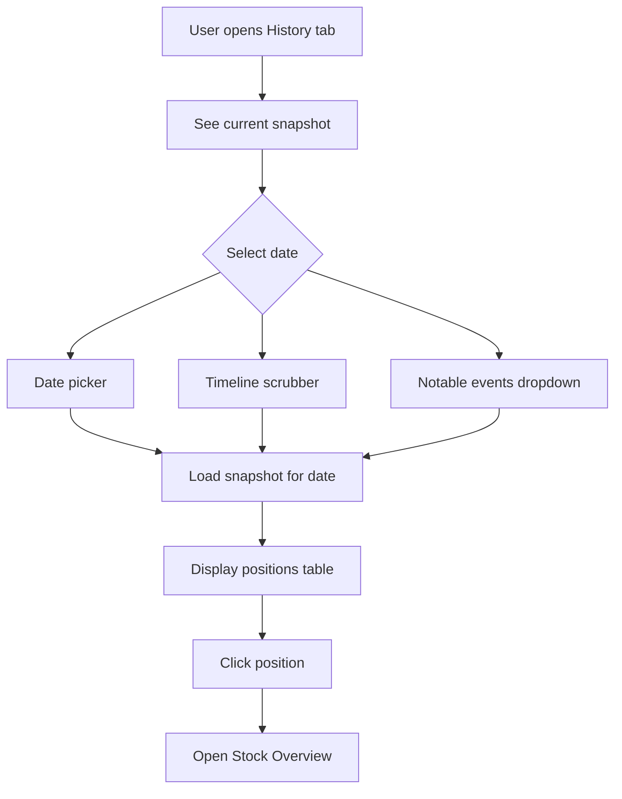

# Historical Analysis Features Plan

## Current Dashboard Tabs

| Tab | Status | Description |

|-----|--------|-------------|

| Summary | Implemented | Balance chart, TWRR, asset allocation |

| Positions | Implemented | Current positions table |

| Activity | Implemented | Transaction history |

| Charts | Implemented | Treemap, gain/loss, heatmap, deposits |

| Balances | Placeholder | Not implemented |

| Planning | Placeholder | Not implemented |

| Import Data | Implemented | CSV import |

## Proposed New Features

### 1. History Tab (New) - "Wayback Machine"

A dedicated tab for exploring historical portfolio states.

**Components:**

- **Date Picker** - Select any date from 2023-01-30 to present
- **Snapshot View** - Shows full portfolio state on selected date:
  - Total value
  - Positions table with allocations
  - Day-over-day change
- **Timeline Scrubber** - Drag to quickly navigate through time
- **Notable Events** - Jump to significant days (biggest gains/losses)
```
+--------------------------------------------------+
|  History                         [Jan 15, 2025 v]|
|  ------------------------------------------------|
|  Portfolio Value: $47,120.29                     |
|  Day Change: +$107.30 (+0.23%)                   |
|  ------------------------------------------------|
|  | Symbol | Shares | Price  | Value   | Alloc  ||
|  |--------|--------|--------|---------|--------|
|  | META   | 26     | $612   | $15,912 | 33.8%  |
|  | GOOGL  | 39.6   | $195   | $7,722  | 16.4%  |
|  ...                                             |
+--------------------------------------------------+
```


---

### 2. Allocation Over Time Chart (Add to Charts Tab)

Line chart showing how position allocations evolved.

**Features:**

- Stacked area chart of allocation %
- Toggle between top 5, top 10, or all positions
- Hover to see exact allocations on any date
- Identify concentration trends

---

### 3. Best/Worst Days Analysis (Add to Charts Tab)

Leaderboard of portfolio performance extremes.

**Components:**

- **Top 10 Best Days** table with date, $ gain, % gain
- **Top 10 Worst Days** table with date, $ loss, % loss
- Click any row to jump to History tab for that date
- Visual distribution chart of daily returns

---

### 4. Position Timeline (Enhance Stock Overview Tab)

Show historical ownership and performance for individual stocks.

**Features:**

- When did you first buy this stock?
- Allocation % over time for this position
- Historical price with your entry points marked
- Peak value and current value comparison

---

### 5. Concentration Risk Chart (Add to Charts Tab)

Track portfolio concentration over time.

**Features:**

- Line showing "Top Position %" over time
- Line showing "Top 3 Positions %" combined
- Alerts when concentration exceeded thresholds
- Diversification score trend

---

## Implementation Priority

| Priority | Feature | Complexity | Value |

|----------|---------|------------|-------|

| 1 | History Tab (Wayback) | Medium | High |

| 2 | Best/Worst Days | Low | High |

| 3 | Allocation Over Time | Medium | High |

| 4 | Concentration Risk | Low | Medium |

| 5 | Position Timeline | Medium | Medium |

---

## Data Loading

Add utility to load snapshots data:

```typescript
// src/utils/loadSnapshots.ts
export async function loadDailySnapshots() {
  const response = await fetch('/data/daily_portfolio_snapshots.json');
  return response.json();
}
```

---

## Files to Create/Modify

| File | Action |

|------|--------|

| [`src/components/HistoryView.tsx`](src/components/HistoryView.tsx) | Create - Main wayback machine component |

| [`src/components/HistoryView.css`](src/components/HistoryView.css) | Create - Styles |

| [`src/components/ChartsView.tsx`](src/components/ChartsView.tsx) | Modify - Add new charts |

| [`src/components/TabNav.tsx`](src/components/TabNav.tsx) | Modify - Add History tab |

| [`src/App.tsx`](src/App.tsx) | Modify - Wire up History tab |

| [`src/utils/loadSnapshots.ts`](src/utils/loadSnapshots.ts) | Create - Data loader |

---

## User Experience

